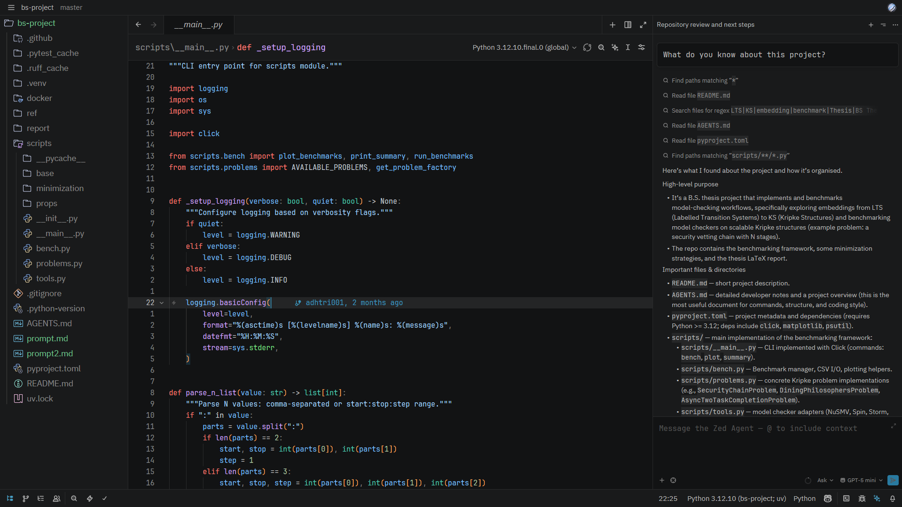
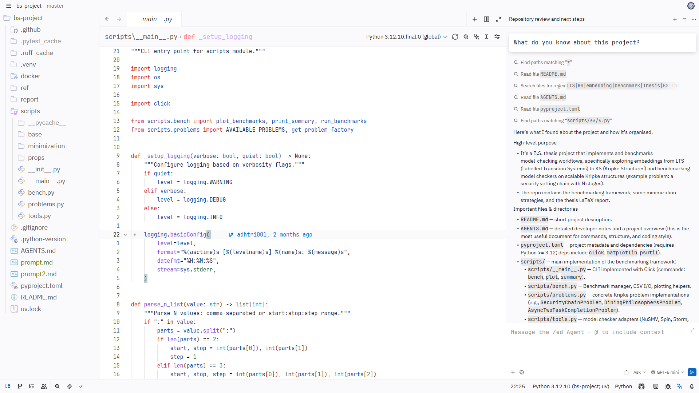

# VS Code 2026 Port Theme for Zed

This repository contains a publishable Zed theme extension that ports VS Code's upstream 2026 themes.

Generated themes:
- VS Code 2026 Dark

- VS Code 2026 Light

## How It Works

The generator resolves VS Code include chains recursively and merges theme data using deterministic rules:
- Includes are resolved first.
- Theme objects are merged with child keys overriding parent keys.
- tokenColors are appended in include order.
- semanticTokenColors are merged by key (child overrides parent).

The output is written to:
- themes/vscode-2026-port-theme.json
- generated/vscode/2026-dark.resolved.json
- generated/vscode/2026-light.resolved.json
- metadata/upstream-sources.json

## Local Development

Requirements:
- Node.js 20+

Commands:
- `npm run generate` regenerates all outputs.
- `npm run verify` checks deterministic output stability.
- `npm run bump:patch` bumps patch version in extension.toml.

## Automation

GitHub Actions workflow:
- `.github/workflows/update-themes.yml`

Triggers:
- Manual dispatch (`workflow_dispatch`)
- Weekly schedule (Monday 06:00 UTC)

Behavior:
- Fetches upstream VS Code theme sources.
- Regenerates resolved + Zed outputs.
- Opens/updates a PR only when generated files changed.
